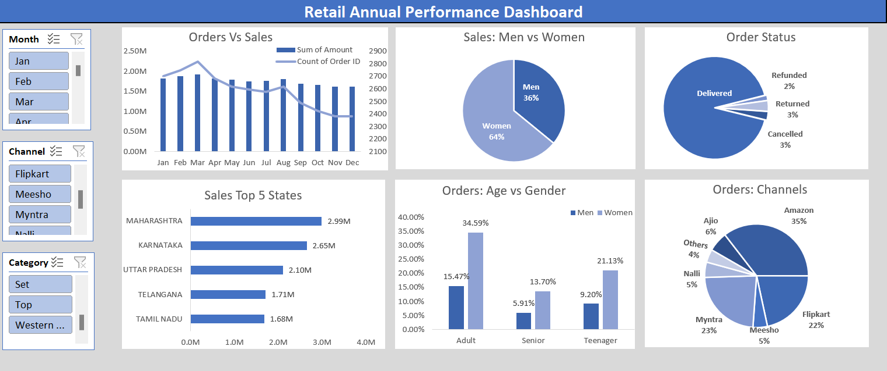

# Retail Annual Performance Dashboard

## Project Overview

An interactive Microsoft Excel dashboard developed to analyze annual retail sales performance across multiple business dimensions.

---

## Dashboard Preview

---

## Key Features

- Interactive slicers for Month, Channel, and Category
- Orders vs Sales trend analysis
- Sales distribution by Gender
- Order Status breakdown
- Top 5 performing States
- Orders by Age Group and Gender
- Sales by Sales Channel

---

## Excel Skills Used

- Pivot Tables
- Pivot Charts
- Slicers
- Data Cleaning
- Conditional Formatting
- Dashboard Design
- Data Visualization

---

## Business Insights

- Women contributed 64% of total sales.
- Amazon generated the highest share of orders.
- Maharashtra recorded the highest sales.
- Adult customers represented the largest customer segment.

---
---

## 🔗 Project Access

**Project Workbook:**  
[Retail_Annual_Performance_Dashboard.xlsx](./Retail_Annual_Performance_Dashboard.xlsx)

**GitHub Repository:**  
https://github.com/Subhajit-dev58/Excel-Data-Analytics-Portfolio

---
## Tools

- Microsoft Excel
